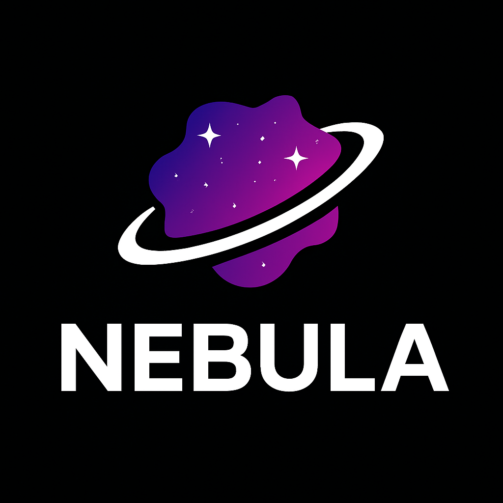

# Nebula Game Engine

<p align="center">
  
</p>

<p align="center">
  <strong>A cross-platform C++ game engine built from scratch, focusing on modern architecture and performance.</strong>
</p>

## 🚀 Current Features

### Rendering System
- ✅ **OpenGL Renderer** - Hardware-accelerated rendering
- ✅ **Shader System** - Abstract shader interface with OpenGL implementation
- ✅ **File-based Shaders** - Load shaders from .glsl files with #type directives
- ✅ **Material System** - PBR-ready materials with textures and properties
- ✅ **Texture Support** - 2D texture loading via stb_image
- ✅ **Mesh Rendering** - 3D mesh system with primitives (cube, sphere, plane)
- ✅ **Framebuffer System** - Render-to-texture for editor viewport
- ✅ **Vertex Arrays & Buffers** - Efficient geometry management
- ✅ **Render Commands** - Platform-agnostic rendering API

### Scene & Entity System
- ✅ **Entity-Component System (ECS)** - Using EnTT library
- ✅ **Scene Management** - Scene graph with entity lifecycle
- ✅ **Components** - Tag, Transform, MeshRenderer, Camera components
- ✅ **Camera System** - Perspective and Orthographic cameras
- ✅ **Scene Rendering** - Component-based rendering pipeline

### Asset Management System 🆕
- ✅ **AssetManager** - Centralized asset loading and caching
- ✅ **GUID-based References** - Unique asset handles for referencing
- ✅ **Asset Registry** - Metadata tracking for all assets
- ✅ **Import Pipeline** - Extensible asset importers
- ✅ **Texture Importer** - Automatic texture loading
- ✅ **Shader Importer** - GLSL shader compilation
- ✅ **Asset Metadata** - .meta file generation
- ✅ **Type Detection** - Automatic asset type from extension

### Cosmic Editor 🆕
- ✅ **Scene Hierarchy** - Entity tree view with creation/deletion
- ✅ **Properties Panel** - Component inspector with drag-drop
- ✅ **Viewport** - 3D scene rendering with first-person camera
- ✅ **Content Browser** - File system navigation with asset icons
- ✅ **Menu Bar** - File operations (New/Save/Load scene)
- ✅ **ImGui Integration** - Modern debug UI framework

### Platform Support
- ✅ **Windows** - Full support with Visual Studio project generation
- ✅ **macOS** - Native support with Makefile generation
- 🎯 **Cross-platform windowing** via GLFW

### Core Systems
- ✅ **Window Management** - Cross-platform window creation and event handling
- ✅ **Event System** - Flexible event-driven architecture
- ✅ **Logging System** - Multi-level logging with spdlog integration
- ✅ **Application Framework** - Base application class with main loop
- ✅ **Layer System** - Efficient layer stack for rendering and updates
- ✅ **Input Handling** - Mouse and keyboard event processing
- ✅ **ImGui Integration** - Debug UI and editor tools

### Development Tools
- ✅ **Premake5 Build System** - Automated project generation
- ✅ **Cross-platform Compilation** - Works on both Windows and macOS
- ✅ **Debug Support** - Assertions and debug break functionality
- ✅ **Asset Pipeline** - Automatic asset copying to build output

## 🎯 Planned Features

### High Priority
- 📋 **Scene Serialization** - Save/load scenes to JSON/YAML format
- 📋 **Lighting System** - Directional, point, and spot lights with shadows
- 📋 **PBR Materials** - Physically-based rendering workflow
- 📋 **Model Importing** - FBX, OBJ, GLTF support via ASSIMP
- 📋 **Editor Gizmos** - Translate/rotate/scale manipulation tools
- 📋 **Entity Picking** - Click-to-select in viewport

### Rendering Enhancements
- 📋 **Batch Rendering** - Optimized draw call batching
- 📋 **Shadow Mapping** - Real-time shadow rendering
- 📋 **Post-Processing** - Bloom, HDR, tone mapping
- 📋 **Skybox** - Environment maps and reflections
- 📋 **DirectX 11/12** - Windows native rendering backend
- 📋 **Metal** - macOS native rendering backend  
- 📋 **Vulkan** - Cross-platform high-performance rendering

### Gameplay Systems
- 📋 **Physics Integration** - Bullet Physics or Box2D
- 📋 **Audio System** - 3D spatial audio with OpenAL/FMOD
- 📋 **Scripting** - Lua or C# integration
- 📋 **Animation System** - Skeletal animation and blend trees
- 📋 **Particle System** - GPU-accelerated particle effects
- 📋 **UI System** - Runtime game UI (not editor UI)

### Platforms
- 📋 **Linux** - Ubuntu/Debian support
- 📋 **Mobile** - iOS and Android deployment

## 🛠️ Building the Engine

### Windows
```bash
# Generate Visual Studio projects
Win-GenerateProjects.bat

# Open Nebula.sln in Visual Studio and build
```

### macOS
```bash
# Generate Makefiles
./Mac-GenerateProjects.sh

# Build with make
make                    # Debug build
make config=release     # Release build

# Run the sandbox
./bin/Debug-macosx-x86_64/Sandbox/Sandbox
```

## 📋 Requirements

- **C++17** compatible compiler
- **Premake5** for project generation
- **Git** for source control

### Platform-Specific Requirements

**Windows:**
- Visual Studio 2019/2022
- Windows SDK

**macOS:**
- Xcode Command Line Tools
- macOS 10.15+ (Catalina or later)

## 🏗️ Architecture Overview

```
Nebula Engine
├── Core Systems
│   ├── Application Framework
│   ├── Window Management (GLFW)
│   ├── Event System
│   ├── Logging (spdlog)
│   └── Asset Management (GUID-based)
├── Rendering
│   ├── Renderer API (OpenGL)
│   ├── Shader System
│   ├── Material System
│   ├── Mesh Rendering
│   └── Framebuffer System
├── Scene System
│   ├── Entity-Component System (EnTT)
│   ├── Scene Graph
│   ├── Components (Transform, MeshRenderer, Camera)
│   └── Scene Rendering Pipeline
├── Asset Pipeline
│   ├── AssetManager (Loading/Caching)
│   ├── Asset Importers (Texture, Shader)
│   ├── Asset Registry & Metadata
│   └── GUID Reference System
└── Cosmic Editor
    ├── Viewport (3D Scene View)
    ├── Scene Hierarchy
    ├── Properties Panel
    ├── Content Browser
    └── Menu Bar
```

## 📚 Documentation

- [Asset Management System](docs/asset-management.md) - Complete guide to the asset pipeline
- [Quick Start Guide](docs/getting-started/quick-start.md) - Get up and running
- [Scene Sharing](docs/getting-started/scene-sharing.md) - Working with scenes

## 🤝 Contributing

See [CONTRIBUTING.md](CONTRIBUTING.md) for detailed contribution guidelines.

## 📄 License

[License information to be added]

---

**Status:** Active Development - Core rendering, ECS, and asset management systems functional. Editor tools operational.
